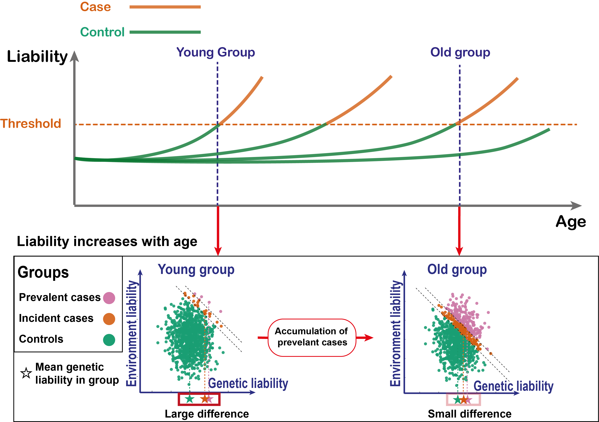

## Age-dependent diseaes architecture

In this document we include all summary data and code that allows you to replicate main results of the [Jiang...Durvasula]().  

I would usually write a R package for my code. However, this project contains multiple parts that are not methodology focused, so we decided it is better to put all pipelines 
as Scripts to increase readability. We do provide a simple [function wrapper](#Estimating-age-dependent-prediction-accuracy) with example data for estimating age variation of prediction accuracy of a risk score, see below. 

We provides three scripts:
- `simulations_GxAge.R`  contains all code that can replicate our simulations.
- `QuantitativeTraitsAnalaysis.R` contains all code that estimate age-dependent genetic and environment variance from summary level data. We can not share the analyses on individual-level data.
- `Binary_traits.R` contains all code that estimate age-dependent prediction accuracy from summary level data. We can not share the analyses on individual-level data.

## We is age-dependent diseaes architecture?
Our analysis focus on both the genetics (**G**) and environment (**E**) components of complex traits and diseases. 
Previous analysis focuses on **GxAge**, while here we analyse both  **GxAge** and **ExAge**. In fact, the main
mechanism we find is ***Exposure Accumulation***, which won't even be detected as **GxAge** in previous analysis (e.g. Robinson et al. 2017 *Nature Genetics*.)

We enjoy reading Miao et al. 2025 *Nature Human Behavior* which provides comprehensive description of different **GxE** models (Table 1 of Miao et al.); most of these 
models can be extend to by setting **Age = E**. Therefore, we focus on mechanism that are unique to **Age** and only listed different models of **GxAge** as secondary analyses. 

To provide the intuition of why analysing **G** and  **E** components of complex traits is important, we can use following schematic figure for liability-threshold model: 


In this figure, disease liability is the sum of the **G** and  **E** components. As age increases, more individuals are getting the diseases by passing the threshold.
- **G** and  **E** variance both can change with age, even if only **E** variance increase with age and **G** variance remain constant, the heritability of disease liability will change with age.
- for disease prediction, removing *prevalent cases* will crease negative correlation between **G** and  **E**, which reduce the prediction power for but **G** and  **E**. 

In this work we first estimate age dependent profiles of **G** and  **E** variance to show that evironment exposure generally accumulate with age. Then we move to show
how this impact prediction accuracy of both genetic and non-genetic predictors. 

## Estimating age-dependent prediction accuracy
After cloning this repository or just download the `GxAge_functions.R` files if you don't need to see the example data, you can run following code to estimate age-dependent prediction accuracy.

```r
source(GxAge_functions.R)
example_data <- fread("Summary_data/example_RiskScore_age_data.txt")
source("GxAge_functions.R")
results <- Prediction_R2_Slope_per10years(example_data, flag_normal_transform_RiskScore = T)
print(paste0("per 10 year change: ", results[[2]]$incident_R2_1to1_slope_10year,
             " z-score = ", results[[2]]$slope_zscore))
```

Note you will need to format your data as the `example_data`. Columns of `example_data` includes:
 - indiviudal_id
 - disease: 1 if disease is observed, 0 if not.
 - age_diag: age point of the disease diagnosis; will be ignored if for rows with disease == 0
 - censor_age: the last observation of the individual
 - RiskScore: the risk score of interest
 - age_risk_measure: age when the risk score was estimated, will be regressed out from risk score; if not available, just set them to be 0. 
 - genetic_sex: genetic sex of the individual, will be regressed out from risk score; if not available, just set them to be 0. 
 - PC1:PC5: additional covariates that should be regressed out from risk score; if you don't need to control 5 covariates, just set the non-used variable to 0 

The three age columns (`age_diag`, `censor_age`, and `age_risk_measure`) represent the age of disease onset, the last observation age of an individual, and age point that
the risk score is measured.
We recommend using the first age at diagnosis for `age_diag` when multiple diagnosis of the disease are presented in the individual. 
`censor_age` should 
be the last age information that is available: death age when death age is available or the age when the data set was last updated. For example, UK Biobank periodically update their
HES data set, so users can compute the age at the latest data update for the individuals who are still alive.
For PRS, `age_risk_measure` can be 0 (at birth); otherwise, it is usally a good choice to use the baseline visit age when risk factors are measured.
We recommend removing the individuals whithout any information of `age_diag` as it doesn't provide age information.
We recommend using the last age available when an individual who interact with the health system for missing `censor_age`, if it cannot be computed from the data update dates.
The analysis can be done if small number of age information are missing. If you cannot find information for majority of individuals in the dataset for any of the three
age columns, perhaps this data set is not suitable for longitudinal analysis. 


## Simulations

All simulation codes were organised in the script `simulations_GxAge.R`. Code below will run the analysis and generate all main figures in the paper. 
The purpose of providing these code is making it flexible for readers to revise for their own analysis.

```r
source(simulations_GxAge.R)
```

In the first section of the script (Figure 4B), we show simulation for the EA model and linear liability-threshold model. We estimated prediction accuracy using 
both incident case prediction and prevalent case association.

In the second section of the script (Figure 4C), we simulate different age-dependency for predictors of different overall prediction accuracy.

## Quantitative traits

Code for quantitative traits and disease liability analyses were organised in the script `QuantitativeTraitsAnalaysis.R`. 
We also release all summary estimate of heritability and genetic correlation in the `Summary_data` folder, in addition to the supplementary tables of the paper. 

```r
source(QuantitativeTraitsAnalaysis.R)
```
Running the script will save all main figures relating quantitative traits or disease liability. 
We recommend users to run different sections of the script for their own research goal as there are many estimates in this script. 

## Binary/disease traits

Code for disease analyses were organised in the script `Binary_traits.R`. This script focus on age-dependent prediction accuracy.  
We also release all summary data in the `Summary_data` folder, in addition to the supplementary tables of the paper. 

```r
source(Binary_traits.R)
```
Running the script will save all main figures relating disease traits. 
We recommend users to run different sections of the script for their own research goal. The beginning parts are the 

